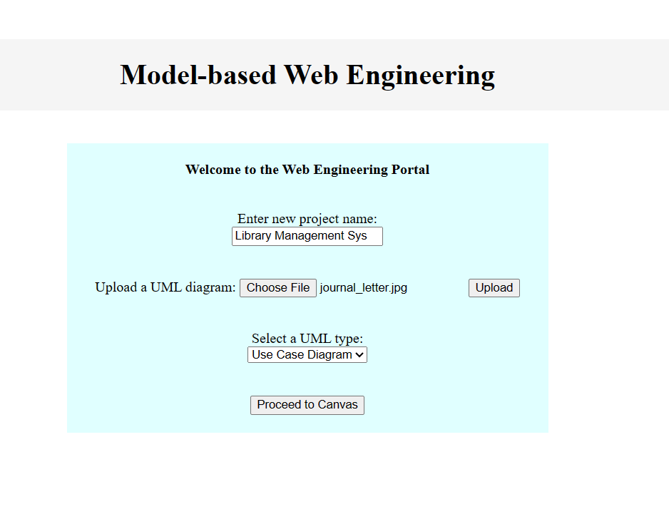

# Model-driven and Deep Learning-based Code Generation for Enhanced Web Development

<br>
<p align="center">
  
</p>
<p align="center"><em>Photo by Mikhail Nilov</em></p>

## Overview
This repository introduces an innovative methodology to simplify web development challenges by incorporating a machine-based code generator. By blending Model-Driven Web Engineering (MDWE) techniques with Deep Learning, the approach offers a streamlined and less code-intensive method for creating web applications. The primary goal is to empower a wider audience, including non-web developers, to contribute effectively to web application development. This repository serves as a platform for exploring and implementing this forward-thinking approach, fostering a more inclusive and efficient web development landscape. Through this methodology, we envision a future where coding for web applications becomes more approachable, enabling diverse individuals to participate meaningfully in the digital ecosystem.

## Table of Contents
- [Overview](#overview)
- [Installation](#installation)
- [Usage](#usage)
- [Screenshots](#screenshots)
- [Acknowledgements](#acknowledgements)
- [License](#license)

## Installation

To use these scripts, you'll need [Python](https://www.python.org/) and [NodeJS](https://nodejs.org/en) installed on your system. Additionally, you may need to install some Python packages to run the scripts. You can do this using pip:

```bash
pip install -r requirements.txt
```

Note that the repository does not include the files in the `node_modules` directory of the server and client in the Code Editor Component. These files can be installed using npm:- 

1. For the `client/node_modules` directory, create a basic react app using npm.
   
```bash
npx create-react-app client
```

2. For the `server/node_modules` directory, the files are loaded as part of installing socket.io.

```bash
npm init
npm i socket.io
```

## Usage
Clone the repository to your local machine and navigate to the repository's directory:

```bash
git clone https://github.com/TimG27/screen-to-web.git
cd screen-to-web.git
```

### UML to Code Component

The UML to Code component can be accessed by simply navigating to the folder and opening the `index.html` homepage in a browser. This will allow you to upload a UML diagram and access the canvas. Run the following commands :-

```bash
cd UML_Component
start index.html
```

### Code Generation Component

The Code Generation Component can be tested accessed by running `server.py`. An image of the webpage will be visibile, and will be converted into an html document. Run the following commands :-

```bash
cd Code_Generation_Component
python server.py
# Now copy the localhost link in your browser. Click on 'generate' to build the html page.
```

### Code Editor Component

The Code Editor Component can be started by running both the npm client and server together. Run the following commands :-

```bash
cd Code_Editor_Component/client/src

del TextEditor.js        #Refreshing the editor
type TextEditor.js
cd ../..

cd client
npm start

cd server
npm run devStart
```

## Screenshots

<p align="center">
  
</p>
<p align="center"><em>Homepage</em></p>
<br>

<p align="center">
  
</p>
<p align="center"><em>A sample of the html-png pair from the training set</em></p>
<br>


##  Acknowledgements
1. [WebDevSimplified](https://twitter.com/DevSimplified) provides a brilliant tutorial on how to build text editors. [Link](https://www.youtube.com/watch?v=iRaelG7v0OU)

## License
This project is licensed under the GNU Affero General Public License v3.0 License - see the `LICENSE.md` file for details.

